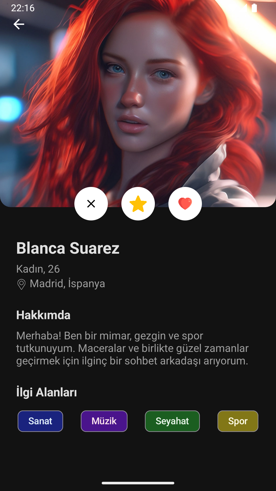
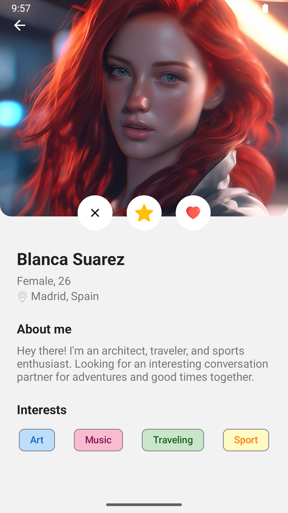

# Android Profil Sayfası UI Örneği (XML)

## Açıklama

Bu proje, [Kasım Adalan](https://github.com/kasimadalan) tarafından verilen Android Geliştirme Bootcamp'i sırasında öğrenilen XML tabanlı arayüz tasarımı bilgilerini pekiştirmek amacıyla geliştirilmiş bir kullanıcı profili sayfası kullanıcı arayüzü (UI) örneğidir. Arayüz, modern sosyal medya veya arkadaşlık uygulamalarında bulunan profil sayfalarına benzer bir yapıya sahiptir ve tamamen XML kullanılarak tasarlanmıştır.

## Özellikler

* **XML Tabanlı Tasarım:** Arayüz tamamen Android XML layoutları kullanılarak oluşturulmuştur. (`ConstraintLayout`, `NestedScrollView`, `LinearLayout`, `ShapeableImageView`, `Chip` vb.)
* **Profil Detayları:** Kullanıcı resmi, adı, temel bilgileri (yaş, konum vb.), hakkında metni ve ilgi alanları gibi kısımları içerir.
* **Tema Desteği:** Hem **Açık Mod (Light Mode)** hem de **Koyu Mod (Night Mode)** için ayrı renk paletleri ve stiller tanımlanmıştır. Sistem temasına otomatik olarak uyum sağlar.
* **Dil Desteği:** Uygulama arayüzü **Türkçe** ve **İngilizce** dillerini desteklemektedir (`strings.xml` kullanılarak yerelleştirme yapılmıştır).
* **Material Design Bileşenleri:** `ShapeableImageView` (yuvarlatılmış köşeler için) ve `Chip` (ilgi alanları için) gibi Material Design bileşenleri kullanılmıştır.
* **Özel Şekillendirme:** `ShapeAppearanceOverlay` kullanılarak `ImageView` için özel köşe yuvarlatmaları (örneğin sadece alt köşeler) uygulanmıştır.

## Teknolojiler

* Android XML Layouts
* ConstraintLayout
* NestedScrollView
* Material Design Components (ShapeableImageView, Chip)
* XML Styles & Themes (Açık/Koyu mod desteği)
* XML String Resources (Dil desteği)

## Ekran Görüntüleri

**Örnekler:**

**Açık Mod (Türkçe)**

**Koyu Mod (Türkçe)**

**Açık Mod (İngilizce)**

**Koyu Mod (İngilizce)**

---
